# 智能算法刷题平台——客户端

## 🖼️仓库介绍

该仓库是智能算法刷题平台的客户端仓库。提供了题库、在线刷题、评论区、题解区、智能刷题助手、用户中心、消息通知等等功能。

## ✨技术栈总览

1. Vue3：前端开发框架。
2. Pinia：全局状态管理。
3. Axios：发送 HTTP 请求。
4. Ant-Design-Vue：CSS 组件库。
5. Ant-Design-X-Vue：AI 组件库。
6. Monaco-Editor：前端代码编辑器。
7. Markdown-it：前端 Markdown 语法渲染库。

## 💻相关界面展示

### 登录、注册页面


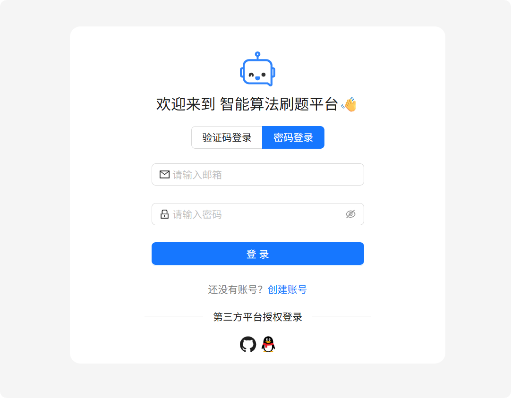

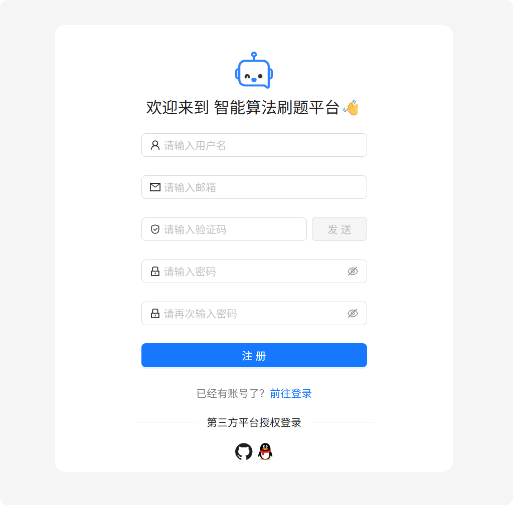

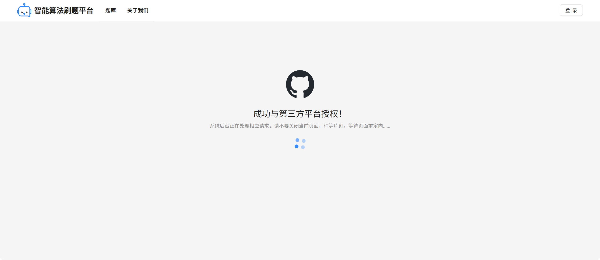

### 个人中心页面

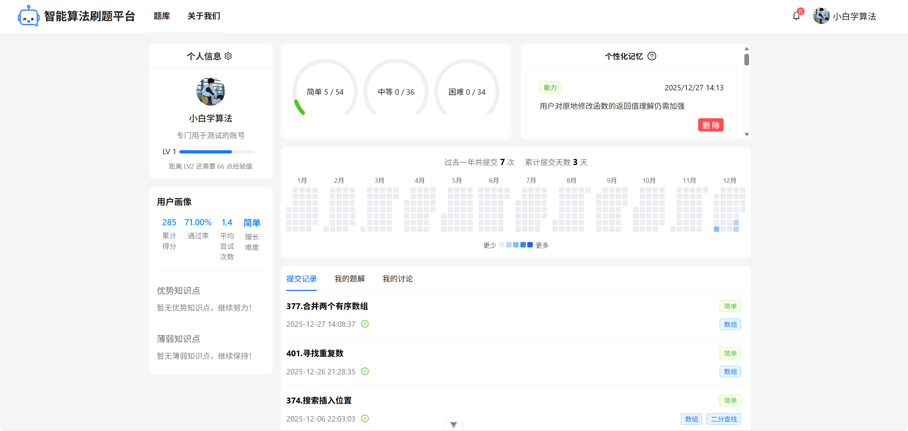

### 账号管理界面


### 消息界面

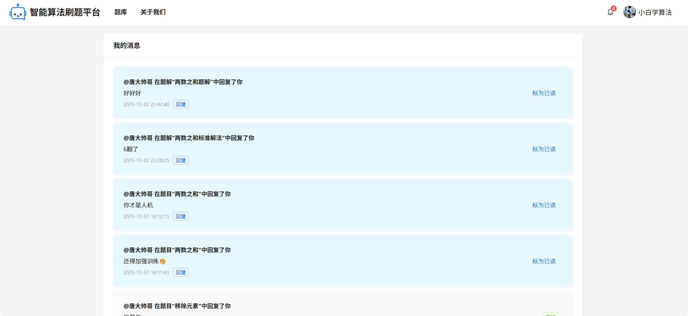

### 创建题解界面

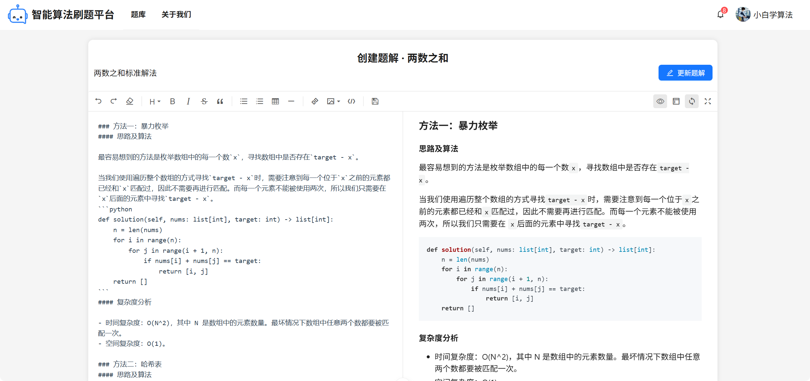

### 题库界面

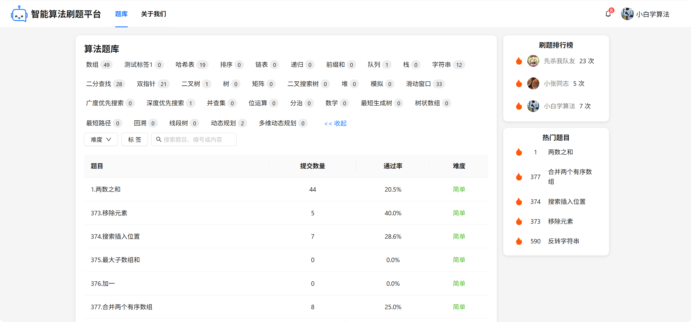

### 在线刷题界面

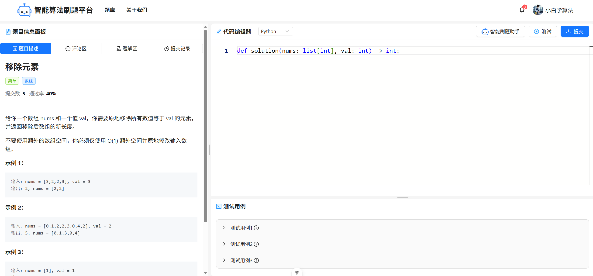

### 智能编程助手页面

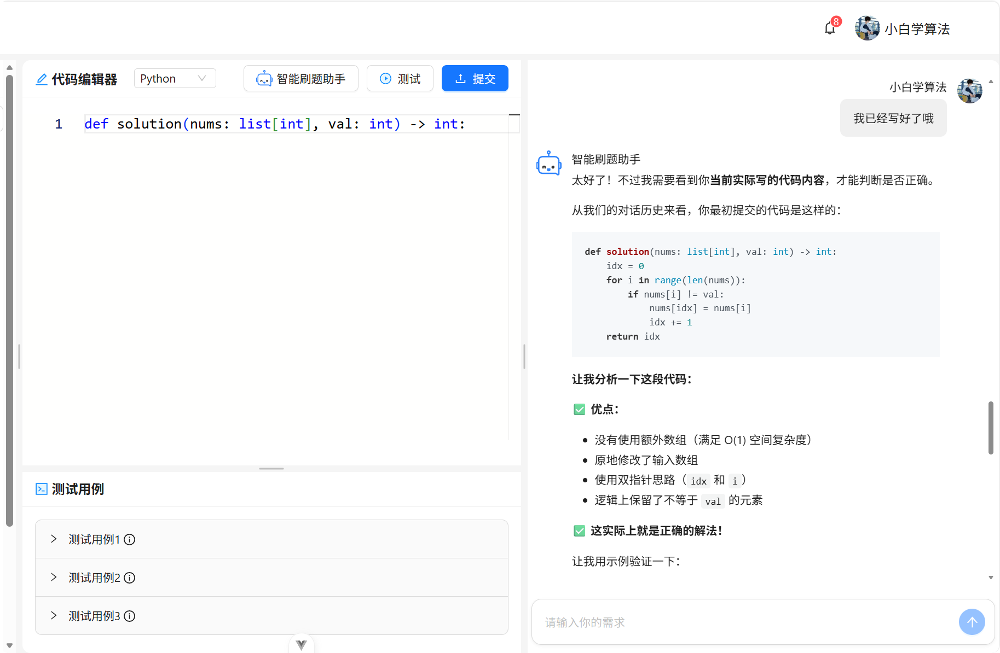

### 讨论区页面

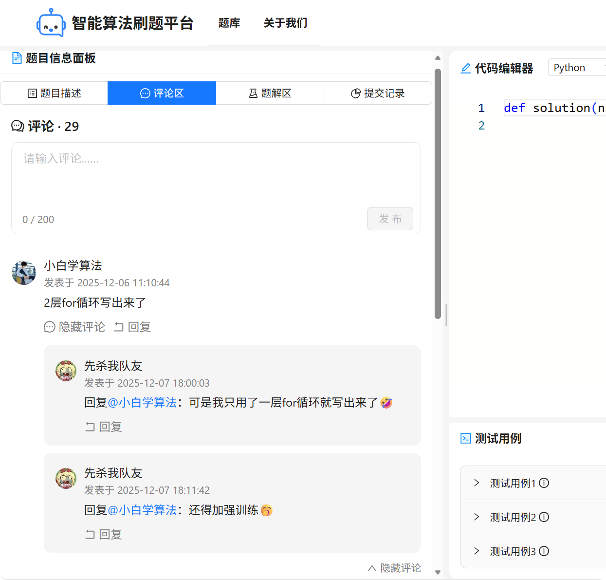

### 题解区页面

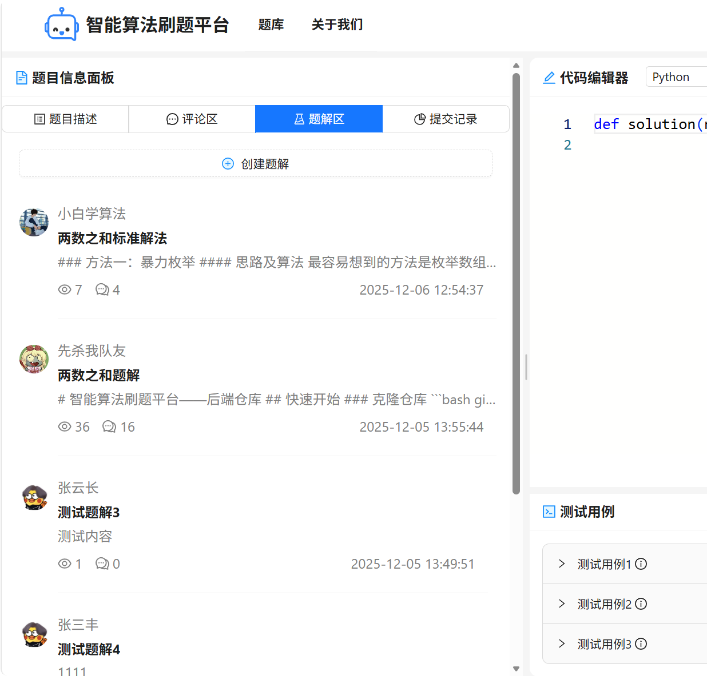

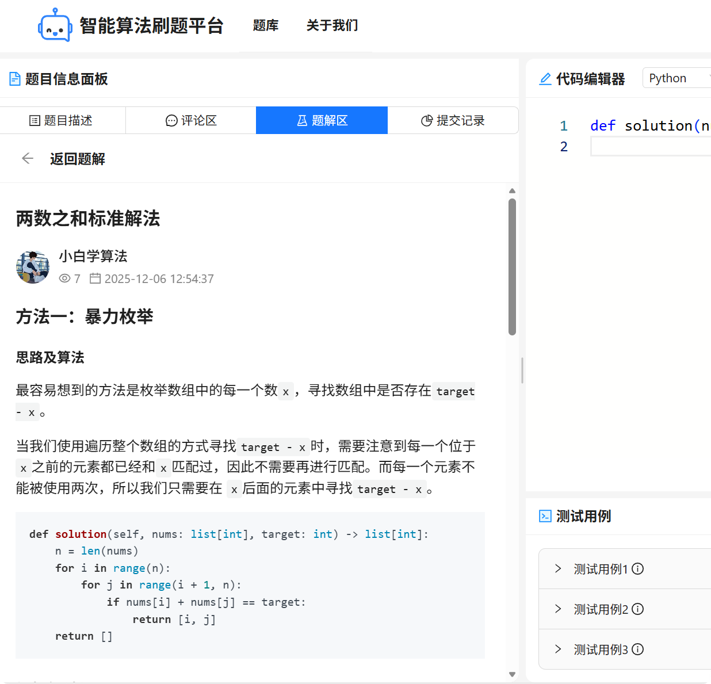

### 提交记录页面

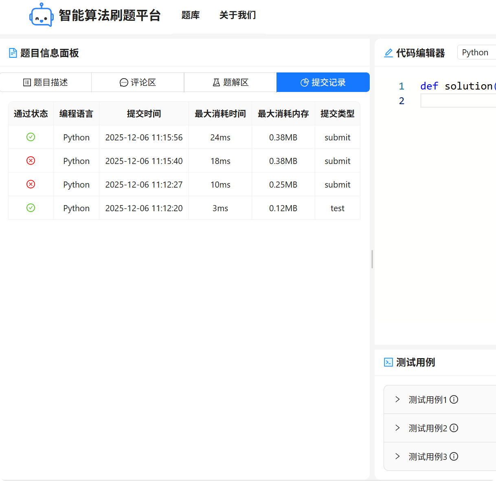

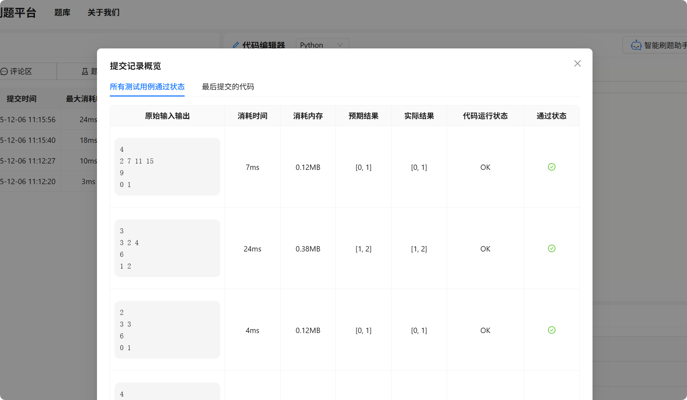

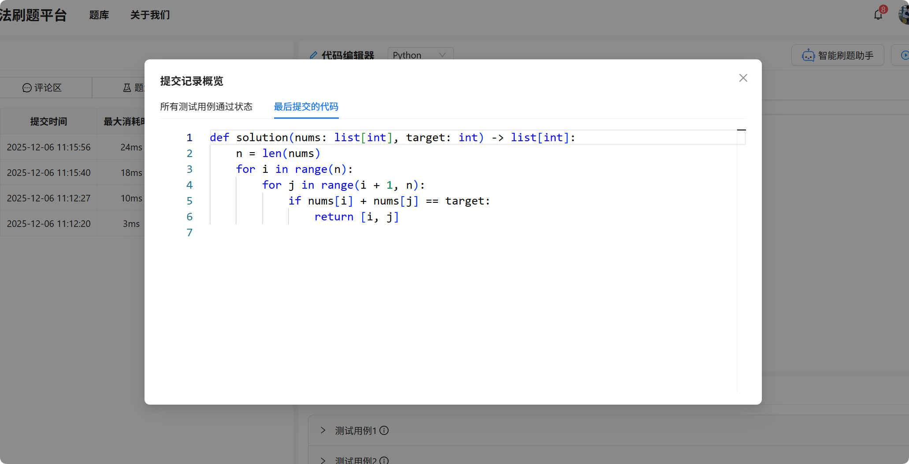

## ⚒️启动项目

项目依赖了后端服务和 AI 服务，因此需要先部署好这两个服务才能正常运行。

1. 后端服务：[后端仓库与相关部署指南](https://github.com/SmartOnlineJudge/smartoj-backend)。
2. AI 服务：[AI 服务代码仓库与相关部署指南](https://github.com/SmartOnlineJudge/smartoj-ai-service)。

首先确认 NodeJS 的版本，项目开发时使用的版本是：`v22.2.0`。

在确认好 NodeJS 的版本以后，编写项目目录下的`.env.production`文件：

```
# 后端接口地址
VITE_BACKEND_URL = http://127.0.0.1:8000

# AI服务后端接口地址
VITE_AI_SERVICE_BACKEND_URL = http://127.0.0.1:8001

# MinIO 地址
VITE_MINIO_URL = http://127.0.0.1:9000

# GitHub 客户端 ID
VITE_GITHUB_CLIENT_ID = 真实的客户端 ID

# GitHub 授权完毕后重定向的 URI
VITE_GITHUB_REDIRECT_URI = http://localhost:5173/login/oauth/redirect/github
```

将个后端地址、AI 服务后端地址、MinIO 地址改成已经部署好的地址，其中 MinIO 地址在部署后端服务之前应该就已经部署好了。

最后的两个配置是 GitHub 的 OAuth2 认证配置，需要提前到 GitHub 上面申请一个 OAuth APP。在申请的过程中就会得到最后两个配置的值了，然后将他们填写在配置项中就可以了。

然后使用常用的 NodeJS 包管理器（npm、pnpm、yarn等）来安装项目的第三方库：

```bash
npm install
```

最后在本地启动项目：

```bash
npm run dev

> smartoj-client@0.0.0 dev
> vite


  VITE v6.2.6  ready in 702 ms

  ➜  Local:   http://localhost:5173/
  ➜  Network: http://10.255.255.254:5173/
  ➜  Network: http://172.21.143.87:5173/
  ➜  Vue DevTools: Open http://localhost:5173/__devtools__/ as a separate window
  ➜  Vue DevTools: Press Alt(⌥)+Shift(⇧)+D in App to toggle the Vue DevTools
  ➜  press h + enter to show help
```

